# Ghent Output Suite Render Gallery

Every checked-in render baseline for the [Ghent PDF Output Suite V5.0](https://gwg.org/) corpus in `test_corpora/ghent`, viewable directly in GitHub. 57 pages across 54 PDFs, rasterized at 2x by `dart_pdf_editor/test/ghent_render_test.dart`.

> **These baselines pin current behaviour, not GWG conformance.** Unlike the [PDF.js gallery](../../pdfjs/_renders/README.md), there is no external reference renderer here and therefore no diff and no pass/fail column - these images *are* the baselines the render test compares against. A green `ghent_render_test` means "unchanged since the last accepted render", not "correct".
>
> Many patches print their own pass criterion on the page, so read them to judge a render. Known deviations: faithful subtractive overprint is not implemented (it needs a CMYK/spot colorant buffer), so the GWG030 "over CMYK" patches are a tolerated deviation, and GWG173's faint "X" is a known JBIG2 difference.

Regenerate this file after adding, removing, or re-accepting baselines:

```sh
fvm dart packages/dart_pdf_editor/tool/rebuild_ghent_render_index.dart
```

Re-accept baselines deliberately - never blanket-accept. See the corpus notes in [`README.md`](../../../README.md#rendering-test-suite).

## Contents

| Category | Pages |
| --- | ---: |
| [1-CMYK](#1-cmyk) | 30 |
| [2-SPOT](#2-spot) | 9 |
| [3-ICC-CMS](#3-icc-cms) | 18 |

## 1-CMYK

### GWG010_CMYK_OP_x3.pdf page 1

511x284

[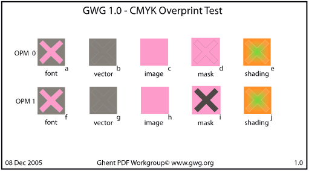](1-CMYK/GWG010_CMYK_OP_x3.pdf.p0.png)

### GWG011_Overprint-Mode_x3.pdf page 1

511x284

[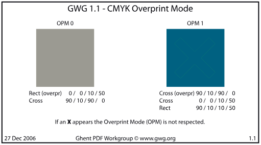](1-CMYK/GWG011_Overprint-Mode_x3.pdf.p0.png)

### GWG050_Font_Substitution_x3.pdf page 1

511x284

[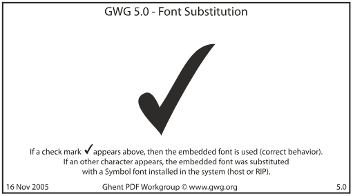](1-CMYK/GWG050_Font_Substitution_x3.pdf.p0.png)

### GWG051_Font_subset_PSnames_ident_x1a.pdf page 1

511x284

[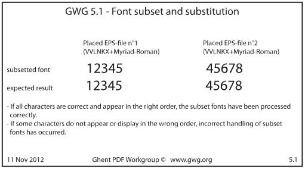](1-CMYK/GWG051_Font_subset_PSnames_ident_x1a.pdf.p0.png)

### GWG052_Font_subset_PSnames_diff_x1a.pdf page 1

511x284

[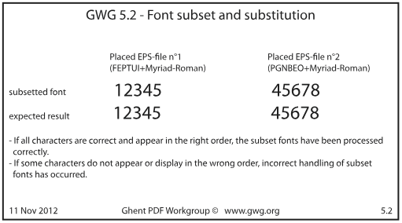](1-CMYK/GWG052_Font_subset_PSnames_diff_x1a.pdf.p0.png)

### GWG060_Shading_x1a.pdf page 1

511x284

[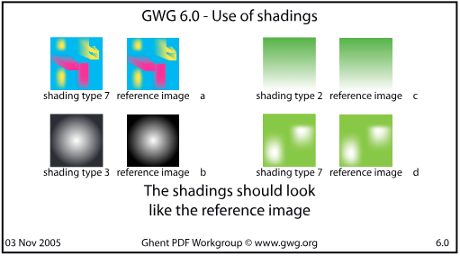](1-CMYK/GWG060_Shading_x1a.pdf.p0.png)

### GWG061_Shading_x1a.pdf page 1

511x284

[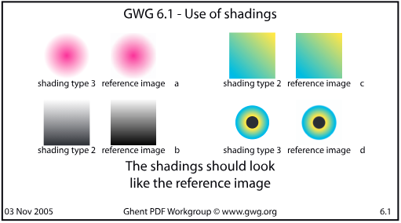](1-CMYK/GWG061_Shading_x1a.pdf.p0.png)

### GWG082_DeviceN-Support_4c_x3.pdf page 1

511x284

[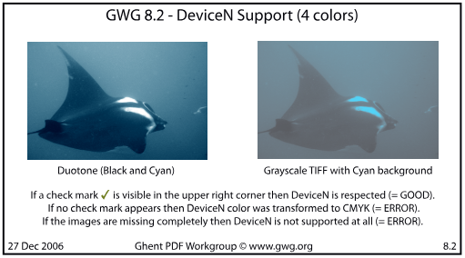](1-CMYK/GWG082_DeviceN-Support_4c_x3.pdf.p0.png)

### GWG090_Font-Support_x3.pdf page 1

511x284

[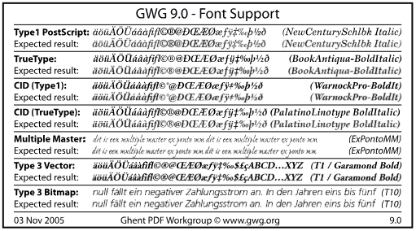](1-CMYK/GWG090_Font-Support_x3.pdf.p0.png)

### GWG091_FontSupport-OpenType_X4.pdf page 1

511x284

[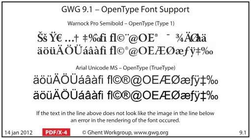](1-CMYK/GWG091_FontSupport-OpenType_X4.pdf.p0.png)

### GWG150_OptionalContent-OCCD_X4.pdf page 1

511x284

[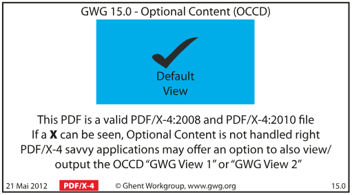](1-CMYK/GWG150_OptionalContent-OCCD_X4.pdf.p0.png)

### GWG151_OptionalContent-RBGroup_X4.pdf page 1

511x284

[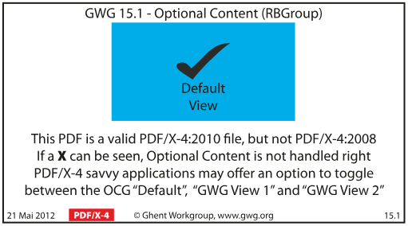](1-CMYK/GWG151_OptionalContent-RBGroup_X4.pdf.p0.png)

### GWG152_OptionalContent-OCMD_X4.pdf page 1

511x284

[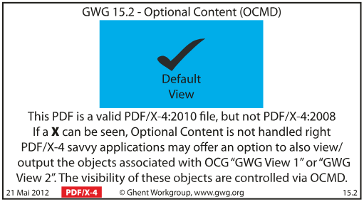](1-CMYK/GWG152_OptionalContent-OCMD_X4.pdf.p0.png)

### GWG160_Transp_Basic_BM_DeviceCMYK_Non-knockout_X4.pdf page 1

511x284

[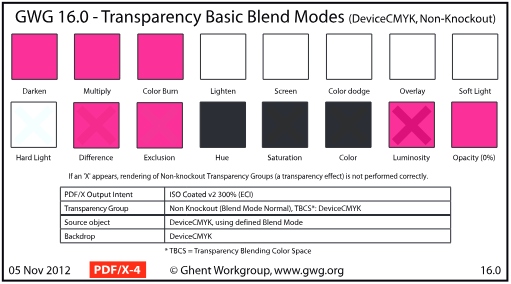](1-CMYK/GWG160_Transp_Basic_BM_DeviceCMYK_Non-knockout_X4.pdf.p0.png)

### GWG1610_Softmasks_Text_part1_X4.pdf page 1

511x284

[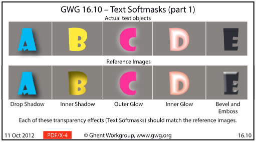](1-CMYK/GWG1610_Softmasks_Text_part1_X4.pdf.p0.png)

### GWG1611_Softmasks_Text_part2_X4.pdf page 1

511x284

[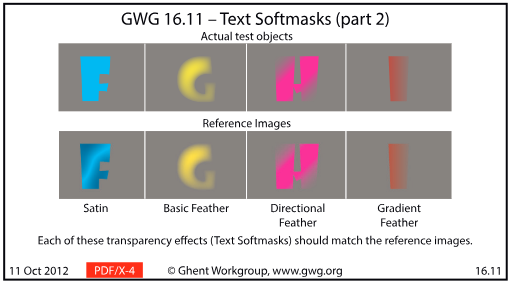](1-CMYK/GWG1611_Softmasks_Text_part2_X4.pdf.p0.png)

### GWG161_Transp_Basic_BM_DeviceCMYK_Knockout_X4.pdf page 1

511x284

[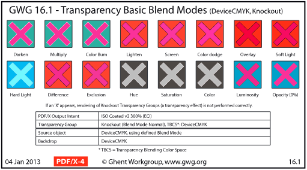](1-CMYK/GWG161_Transp_Basic_BM_DeviceCMYK_Knockout_X4.pdf.p0.png)

### GWG162_Transp_Basic_BM_DeviceCMYK_Isolate_X4.pdf page 1

511x284

[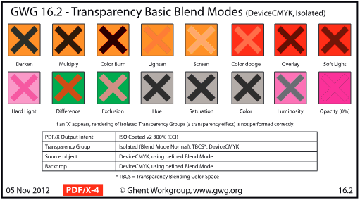](1-CMYK/GWG162_Transp_Basic_BM_DeviceCMYK_Isolate_X4.pdf.p0.png)

### GWG166_Softmasks_Images_DeviceCMYK_X4.pdf page 1

511x284

[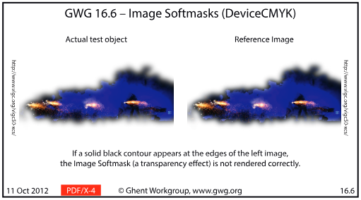](1-CMYK/GWG166_Softmasks_Images_DeviceCMYK_X4.pdf.p0.png)

### GWG168_Softmasks_Vector_part1_X4.pdf page 1

511x284

[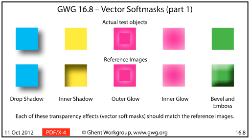](1-CMYK/GWG168_Softmasks_Vector_part1_X4.pdf.p0.png)

### GWG169_Softmasks_Vector_part2_X4.pdf page 1

511x284

[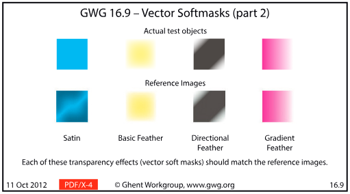](1-CMYK/GWG169_Softmasks_Vector_part2_X4.pdf.p0.png)

### GWG170_JPEG2000_compression_DeviceCMYK_X4.pdf page 1

511x284

[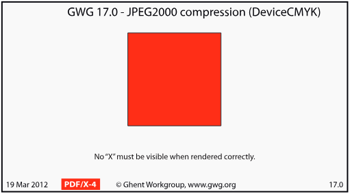](1-CMYK/GWG170_JPEG2000_compression_DeviceCMYK_X4.pdf.p0.png)

### GWG173_JBIG2_compression_X4.pdf page 1

511x284

[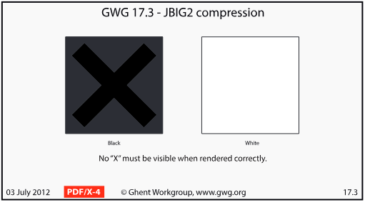](1-CMYK/GWG173_JBIG2_compression_X4.pdf.p0.png)

### GWG181_16Bit_DeviceCMYK_x4.pdf page 1

511x284

[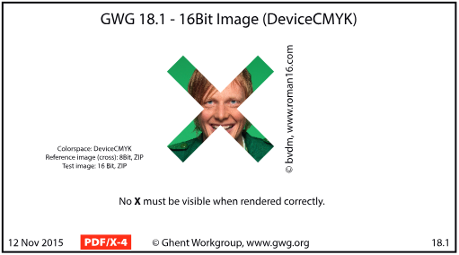](1-CMYK/GWG181_16Bit_DeviceCMYK_x4.pdf.p0.png)

### GWG190_DeviceN_Overprint_Black_X1a.pdf page 1

511x284

[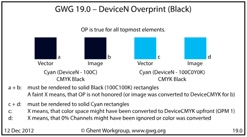](1-CMYK/GWG190_DeviceN_Overprint_Black_X1a.pdf.p0.png)

### GWG191_DeviceN_Overprint_Yellow_X1a.pdf page 1

511x284

[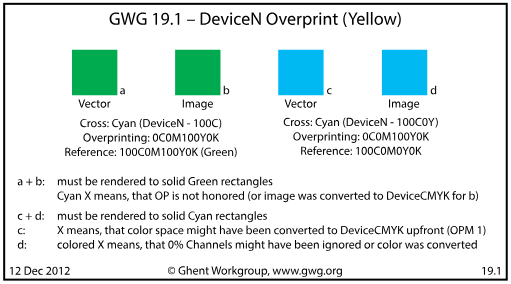](1-CMYK/GWG191_DeviceN_Overprint_Yellow_X1a.pdf.p0.png)

### GWG192_DeviceN_Overprint_White_X1a.pdf page 1

511x284

[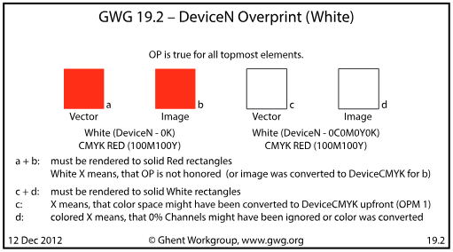](1-CMYK/GWG192_DeviceN_Overprint_White_X1a.pdf.p0.png)

### Ghent_PDF-Output-Test-V50_CMYK_X4.pdf page 1

1191x1582

[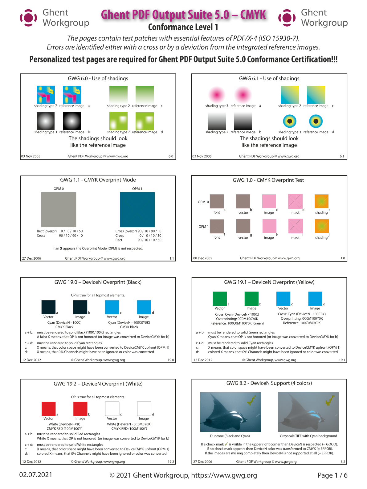](1-CMYK/Ghent_PDF-Output-Test-V50_CMYK_X4.pdf.p0.png)

### Ghent_PDF-Output-Test-V50_CMYK_X4.pdf page 2

1191x1582

[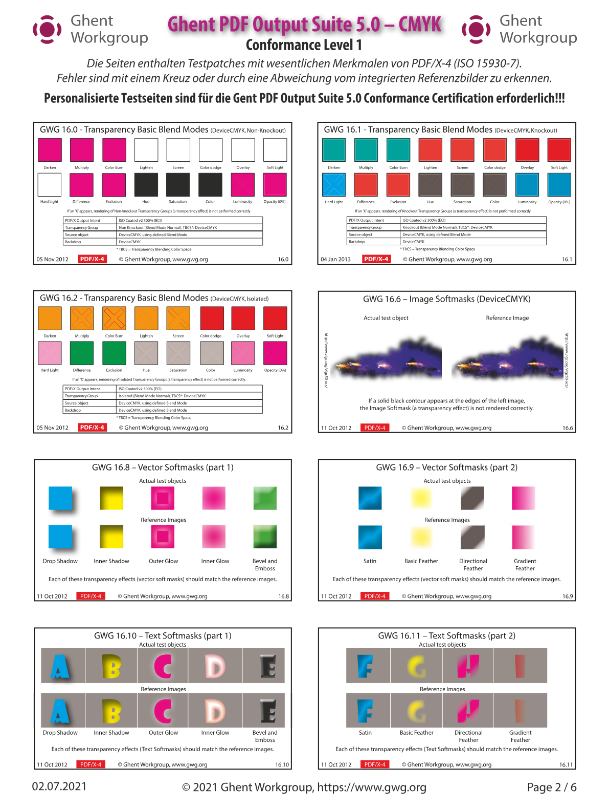](1-CMYK/Ghent_PDF-Output-Test-V50_CMYK_X4.pdf.p1.png)

### Ghent_PDF-Output-Test-V50_CMYK_X4.pdf page 3

1191x1582

[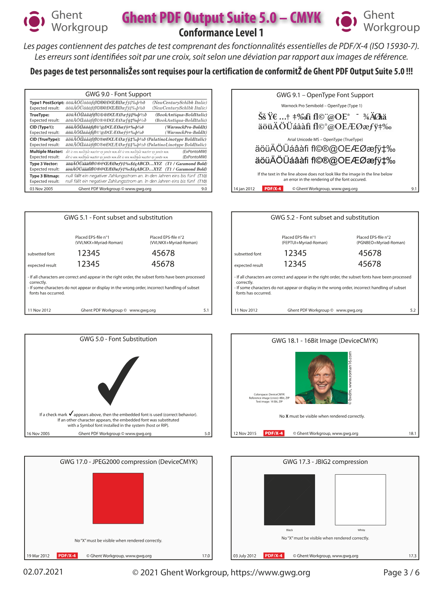](1-CMYK/Ghent_PDF-Output-Test-V50_CMYK_X4.pdf.p2.png)

## 2-SPOT

### GWG020_CMYKSpot_OP_x1a.pdf page 1

511x284

[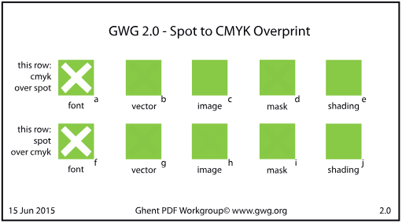](2-SPOT/GWG020_CMYKSpot_OP_x1a.pdf.p0.png)

### GWG030_Gray_K_black_OP_X1.pdf page 1

511x284

[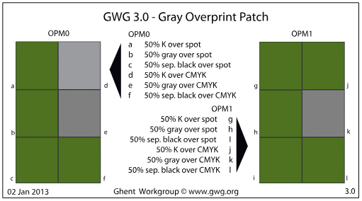](2-SPOT/GWG030_Gray_K_black_OP_X1.pdf.p0.png)

### GWG031_Gray Image Overprint_CMYK+Spot_X1a.pdf page 1

511x284

[](2-SPOT/GWG031_Gray%20Image%20Overprint_CMYK%2BSpot_X1a.pdf.p0.png)

### GWG040_White_OP_x1a.pdf page 1

511x284

[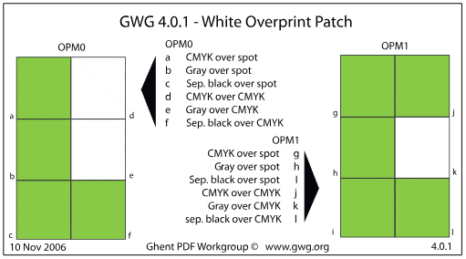](2-SPOT/GWG040_White_OP_x1a.pdf.p0.png)

### GWG041_White_OP_x3.pdf page 1

511x284

[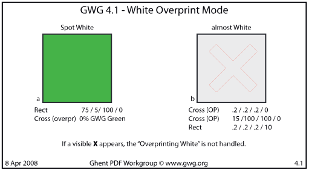](2-SPOT/GWG041_White_OP_x3.pdf.p0.png)

### GWG080_DeviceN-Support_6c_x3.pdf page 1

511x284

[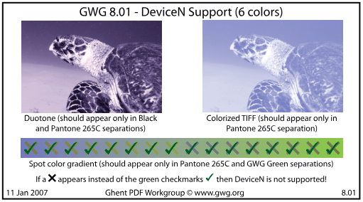](2-SPOT/GWG080_DeviceN-Support_6c_x3.pdf.p0.png)

### GWG081_DeviceN-Support_5c_X1a.pdf page 1

511x284

[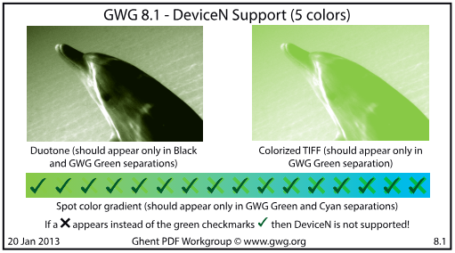](2-SPOT/GWG081_DeviceN-Support_5c_X1a.pdf.p0.png)

### GWG120_White_OP-KO_X1.pdf page 1

511x284

[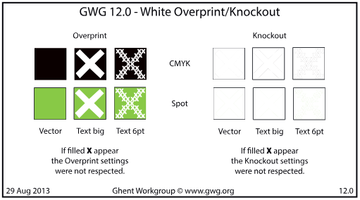](2-SPOT/GWG120_White_OP-KO_X1.pdf.p0.png)

### Ghent_PDF-Output-Test-V50_SPOT_X4.pdf page 1

1191x1582

[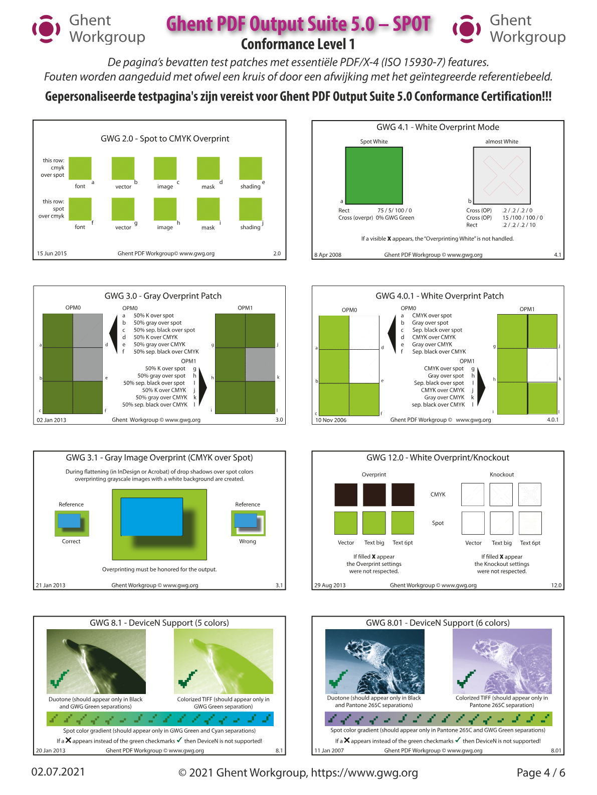](2-SPOT/Ghent_PDF-Output-Test-V50_SPOT_X4.pdf.p0.png)

## 3-ICC-CMS

### GWG130_ICC_Source_Profile_x4.pdf page 1

511x284

[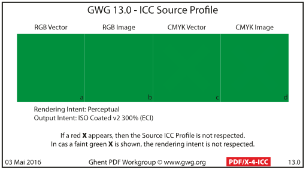](3-ICC-CMS/GWG130_ICC_Source_Profile_x4.pdf.p0.png)

### GWG132_ICCbasedCMYK_OverPrint_x4.pdf page 1

511x284

[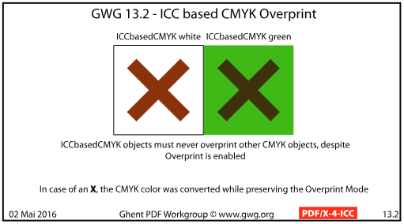](3-ICC-CMS/GWG132_ICCbasedCMYK_OverPrint_x4.pdf.p0.png)

### GWG133_ICCbasedRGB_OverPrint_x4.pdf page 1

511x284

[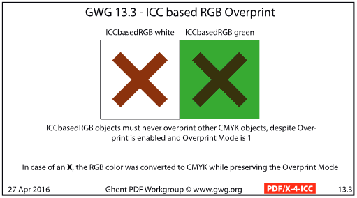](3-ICC-CMS/GWG133_ICCbasedRGB_OverPrint_x4.pdf.p0.png)

### GWG161_Transp_Basic_BM_ICCBasedRGB_x4.pdf page 1

511x284

[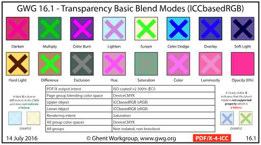](3-ICC-CMS/GWG161_Transp_Basic_BM_ICCBasedRGB_x4.pdf.p0.png)

### GWG164_Transp_Basic_BM_ICCbasedCMYK_x4.pdf page 1

511x284

[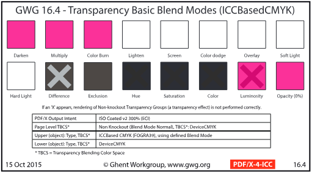](3-ICC-CMS/GWG164_Transp_Basic_BM_ICCbasedCMYK_x4.pdf.p0.png)

### GWG167_Softmasks_Images_ICCBasedRGB_x4.pdf page 1

511x284

[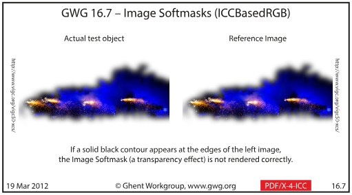](3-ICC-CMS/GWG167_Softmasks_Images_ICCBasedRGB_x4.pdf.p0.png)

### GWG172_JPEG2000_compression_ICCBasedRGB_x4.pdf page 1

511x284

[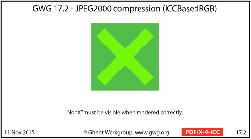](3-ICC-CMS/GWG172_JPEG2000_compression_ICCBasedRGB_x4.pdf.p0.png)

### GWG180_16Bit_Images_ICCbasedRGB_x4.pdf page 1

511x284

[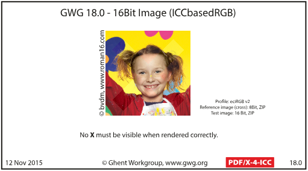](3-ICC-CMS/GWG180_16Bit_Images_ICCbasedRGB_x4.pdf.p0.png)

### GWG182_16Bit_Images_ICCbasedGray_x4.pdf page 1

511x284

[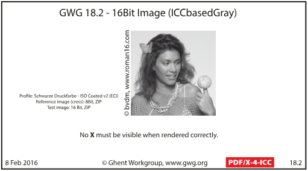](3-ICC-CMS/GWG182_16Bit_Images_ICCbasedGray_x4.pdf.p0.png)

### GWG183_16Bit_Images_DeviceGray_x4.pdf page 1

511x284

[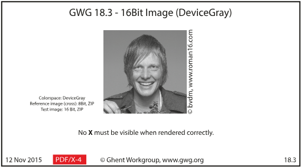](3-ICC-CMS/GWG183_16Bit_Images_DeviceGray_x4.pdf.p0.png)

### GWG184_16Bit_Images_ICCbasedCMYK_x4.pdf page 1

511x284

[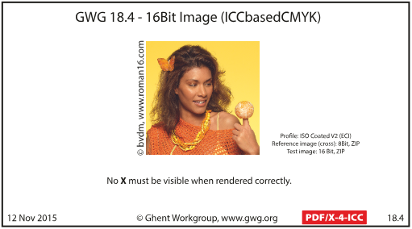](3-ICC-CMS/GWG184_16Bit_Images_ICCbasedCMYK_x4.pdf.p0.png)

### GWG205_ICC-V4-CMYK-Image_x4.pdf page 1

511x284

[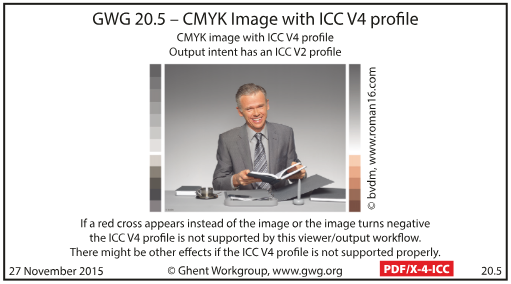](3-ICC-CMS/GWG205_ICC-V4-CMYK-Image_x4.pdf.p0.png)

### GWG206_ICC_V4-RGB-Image_x4.pdf page 1

511x284

[](3-ICC-CMS/GWG206_ICC_V4-RGB-Image_x4.pdf.p0.png)

### GWG220_ColorConversionIndicator_x4.pdf page 1

511x284

[](3-ICC-CMS/GWG220_ColorConversionIndicator_x4.pdf.p0.png)

### GWG221_OutputIntentChangeIndicator_x4.pdf page 1

511x284

[](3-ICC-CMS/GWG221_OutputIntentChangeIndicator_x4.pdf.p0.png)

### GWG230_Four_different Grays_x1a.pdf page 1

511x284

[](3-ICC-CMS/GWG230_Four_different%20Grays_x1a.pdf.p0.png)

### Ghent_PDF-Output-Test-V50_ICC-CMS_X4.pdf page 1

1191x1582

[](3-ICC-CMS/Ghent_PDF-Output-Test-V50_ICC-CMS_X4.pdf.p0.png)

### Ghent_PDF-Output-Test-V50_ICC-CMS_X4.pdf page 2

1191x1582

[](3-ICC-CMS/Ghent_PDF-Output-Test-V50_ICC-CMS_X4.pdf.p1.png)

